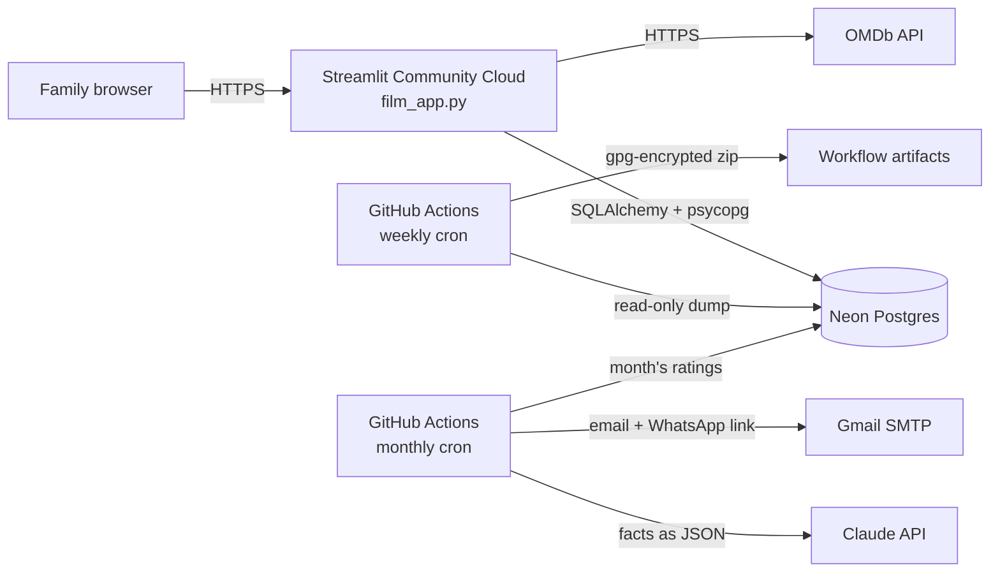
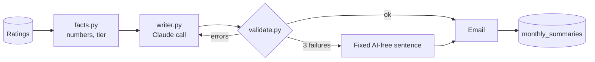

# Family Movie Ratings

[](https://github.com/josephperrin98/perrin-family-movies/actions/workflows/tests.yml)

A small web app my family uses to rate the films we watch together, keep a
watchlist, and settle arguments with a fair "family Top 100". On the 1st of
each month, Claude writes a short, funny recap of what everyone watched, for
the family WhatsApp group.

Built with Python and [Streamlit](https://streamlit.io), backed by Postgres,
with film data from the [OMDb API](https://www.omdbapi.com/).

## How we use it

1. Open the app and enter the shared family passphrase.
2. Pick who you are on the "Who's watching?" screen.
3. Search for a film you've watched, give it a score out of 10 and a comment,
   and flag whether it's suitable for the whole family.
4. Browse what everyone else has been watching, open any film to see all the
   family's ratings, and add films to your watchlist.
5. Check the **Top 100**, filterable by genre and country.

## Features

| Page | What it does |
|---|---|
| Browse | Search OMDb and see the family's latest ratings, filterable by person and genre |
| Top 100 | Family ranking using per-person normalised scores (see below) |
| Family | Everyone's profile and stats |
| Your Movies | Your ratings and watchlist, or anyone else's |
| Add Review | Find a film via OMDb (or enter it manually) and rate it |

### Fair rankings: per-person z-score normalisation

Some people rate everything 8+, others rarely go above 6. A plain average
rewards films watched by generous raters. The Top 100 instead converts each
score into a *z-score*: how far it sits from **that person's** average, in units
of **that person's** spread (standard deviation). Those are mapped back onto a
1–10 scale and averaged per film, so a 7 from a harsh critic can outrank a 9
from someone who loves everything. See `get_family_top100` in
[`database.py`](database.py).

## Architecture



- **Code** lives in this repo. Streamlit Community Cloud redeploys on every
  push to `main`.
- **Data** lives in [Neon](https://neon.tech), a serverless Postgres. Nothing
  personal is stored in git.
- **Secrets** (database URL, API keys, passphrase) are stored in Streamlit's
  and GitHub's secret managers, never in the repo.

### Project layout

```
film_app.py            Entry point: page config, navigation, routing
identity.py            Family passphrase gate and "who's watching" picker
database.py            Schema and all SQL queries (SQLAlchemy Core)
omdb.py                OMDb API client
pages/                 One module per screen
components/            Reusable UI pieces (movie cards, search, filters)
summary/               Monthly summary (service layer, no Streamlit)
  facts.py             Computes every number: averages, ranking, tier
  store.py             All of its SQL, behind one class
  writer.py            The Claude call, with structured output
  prompt_fr.txt        The system prompt (French)
  validate.py          Checks Claude's text against the facts
  service.py           Orchestration: retry, fallback, email, record
  render.py            Title, bullets, AI-free fallback text
  delivery.py          Email with a "send to WhatsApp" link
  titles.py            Original titles from TMDB
scripts/
  import_csv.py        Bulk-import ratings from a spreadsheet export
  backup_database.py   Dump every table to a zip of CSVs
  send_monthly_summary.py   Command-line entry point for the summary
evals/                 Fake months and reports used to tune the prompt
examples/              Demo CSV in the import format
tests/                 unittest suite (no network or database needed)
```

## Running it yourself

### 1. Get your keys

| Secret | Where to get it |
|---|---|
| `DATABASE_URL` | Create a free project on [Neon](https://neon.tech), then **Connect** → copy the *pooled* connection string. Any Postgres works. |
| `OMDB_API_KEY` | Request a free key at [omdbapi.com/apikey.aspx](https://www.omdbapi.com/apikey.aspx). It arrives by email and must be activated. |
| `TMDB_READ_TOKEN` | Optional, for display titles in the monthly summary. Free account on [themoviedb.org](https://www.themoviedb.org/) → Settings → API → *API Read Access Token*. |
| `ANTHROPIC_API_KEY` | Monthly summary only. [console.anthropic.com](https://console.anthropic.com) → API Keys. Shown once: store it in a password manager. |
| `SMTP_USER`, `SMTP_APP_PASSWORD` | Monthly summary only. A Gmail address with 2-Step Verification on, and an [app password](https://myaccount.google.com/apppasswords) (not the account password). |
| `SUMMARY_TO` | Monthly summary only. Where the summary email goes. |
| `family_pin` | Optional. Any passphrase. Prefer a few words over 4 digits: there is no lockout on wrong attempts. |

### 2. Run locally

Requires Python 3.11+.

```bash
python3.11 -m venv .venv
source .venv/bin/activate
pip install -r requirements.txt
cp .streamlit/secrets.toml.example .streamlit/secrets.toml   # then edit it
streamlit run film_app.py
```

Tables are created automatically on first launch. If there are no users yet,
the people listed under `family_members` in your secrets are created (or three
demo members if you leave it out).

### 3. Deploy

On [Streamlit Community Cloud](https://share.streamlit.io): **Create app** →
pick this repo, branch `main`, file `film_app.py` → paste the contents of your
`secrets.toml` into **Advanced settings → Secrets**.

### Importing ratings from a spreadsheet

The importer reads a CSV exported from our original family spreadsheet (French
column headers). See [`examples/demo_ratings.csv`](examples/demo_ratings.csv)
for the format. Users must already exist; contributors are matched by display
name.

```bash
DATABASE_URL=... OMDB_API_KEY=... python scripts/import_csv.py examples/demo_ratings.csv
```

## Monthly summary: an LLM in a box

On the 1st of each month, a GitHub Actions job emails me the family's
recap with a green **Envoyer sur WhatsApp** button. One tap opens WhatsApp
with the text pre-filled; I read it and forward it to the group. WhatsApp
has no free API for posting to groups, and a human check before anything
reaches the family is a feature anyway.

The message has three parts:

```
*Résumé Perrin-rama — octobre 2026*          ← code

Two or three warm, funny sentences: the       ← Claude
month's highlights, one joke, an invitation
to watch and rate more films.

🎬 12 notes · moyenne 7,4/10                  ← code
🥇 «Le Prénom» 8,6 …
```

### Code computes the facts, Claude only writes the colour

Language models are good at tone and bad at arithmetic and at not inventing
things. So every number, ranking and title shown is computed in Python
([`summary/facts.py`](summary/facts.py)) and rendered by code. Claude receives
those facts as JSON and writes only the opening paragraph, which may not
contain a single digit. If Claude gets something wrong, the facts are still
right.



### Guardrails

- **Structured output.** The [SDK](https://github.com/anthropics/anthropic-sdk-python)'s
  `messages.parse` returns a Pydantic object (`message`, `titles_mentioned`,
  `names_mentioned`), not free text to parse.
- **Validation** ([`summary/validate.py`](summary/validate.py)) rejects:
  a title that isn't one of the month's films or a family classic; a first
  name of someone who didn't rate anything (checked in the text itself, not
  just in what Claude says it mentioned); more than two people named; any
  digit; the wrong length for the month's size; no question at the end; text
  too similar to the last three summaries.
- **Retry with feedback.** A rejected draft goes back in a new, standalone
  request with the exact list of errors, up to three attempts. After that, the
  family gets the facts with a fixed sentence written by me. The summary
  never fails to arrive because of the AI.
- **Email first, then record.** A row in `monthly_summaries` marks the month as
  sent. It's written only after the email leaves, so a failed send is simply
  retried next run, and a second run for the same month does nothing.
- **Public logs stay clean.** The repo is public, so its workflow logs are too:
  the job prints counts and token usage, never names, comments or the message.

### Evals: how the prompt was tuned

The prompt ([`summary/prompt_fr.txt`](summary/prompt_fr.txt)) was tuned on
ten fake months with a fake family, never on real data
([`evals/`](evals/)): seven for development, three held back until the end
to check the prompt hadn't just learned the examples. Each run measures the
**first** attempt only, since production retries would hide a weak prompt,
and writes a report for me to score the humour by hand. One prompt change
per commit, with its report.

| Version | Change | Dev set | Cost |
|---|---|---|---|
| v1 | First prompt | 7/7 | $0.14 |
| v2 | Humour guidance and the family's classic films | 6/7 | $0.20 |
| v3 | Fewer jokes: highlights, one joke, invitation | 7/7 | $0.18 |
| v4 | General closing invitation, never naming who didn't rate | 6/7 | $0.19 |
| v4 | **Holdout** | **3/3** | $0.07 |

The v4 failure was a "100 %" in the text, which validation catches and a
retry fixes. Each summary costs about two cents with `claude-opus-5-5`.

### Running it

```bash
# Print last month's summary without sending or recording anything
python -m scripts.send_monthly_summary --dry-run

# Send a given month (can be extended into the next one)
python -m scripts.send_monthly_summary --month 2026-09 --until 2026-10-09
```

[`monthly-summary.yml`](.github/workflows/monthly-summary.yml) runs this on the
1st of each month. A manual run from the Actions tab defaults to a dry run.

## Backups

[`weekly-backup.yml`](.github/workflows/weekly-backup.yml) dumps every table
each Monday, encrypts the zip with `gpg` (AES-256), and keeps it as a workflow
artifact for 90 days. Artifacts on a public repo can be downloaded by anyone
signed in to GitHub, so the workflow refuses to upload unless the
`BACKUP_PASSPHRASE` repository secret is set.

To restore, download the artifact and decrypt it:

```bash
gpg --decrypt backup_YYYYMMDD_HHMMSS.zip.gpg > backup.zip
```

## Tests

```bash
python -m unittest -v
```

The suite needs no network or database. It runs on every push via
[`tests.yml`](.github/workflows/tests.yml).

## Design notes

- **Dependencies are pinned to exact versions.** In September 2026 the app went
  down without a single code change: `requirements.txt` allowed any SQLAlchemy
  `>=2.0`, and SQLAlchemy 2.1 switched its default Postgres driver from
  psycopg2 to psycopg 3. Pinning makes upgrades deliberate, and
  [`tests/test_dependencies.py`](tests/test_dependencies.py) catches a
  driver mismatch without touching a database.
- **One shared passphrase, not per-person accounts.** The realistic threat for a
  family app is a stranger finding the URL, not relatives impersonating each
  other. The passphrase is compared with `hmac.compare_digest` so response time
  doesn't reveal how much of a guess was right.
- **Standard library first.** Tests use `unittest`, backups use `zipfile` and
  `csv`, email uses `smtplib`. Every extra dependency is something that can
  break.
- **Hide nothing behind a library's retries.** The first live email failed
  with "connection unexpectedly closed". The real cause was a wrong password:
  `smtplib.login()` retries a second login method after Gmail's refusal,
  Gmail hangs up, and the original error is lost. The code now uses one
  method so the real error comes through
  ([`summary/delivery.py`](summary/delivery.py)).

## Roadmap

- [x] Monthly summary written by Claude (above)
- [ ] Film recommendations for the family, from everyone's ratings
- [ ] Logging past viewings in plain language ("we saw Dune on Sunday, 8/10")

## License

[MIT](LICENSE)

This product uses the TMDB API but is not endorsed or certified by TMDB.
