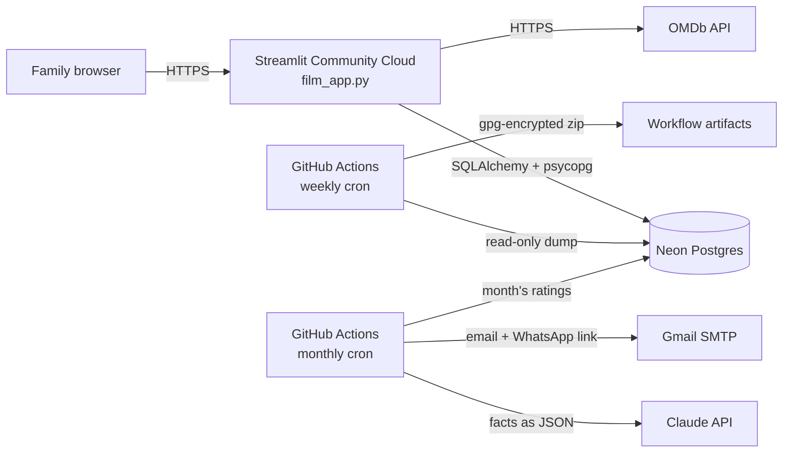
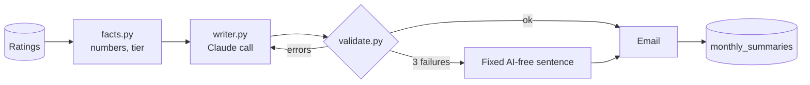

# Family Movie Ratings

[](https://github.com/josephperrin98/perrin-family-movies/actions/workflows/tests.yml)

A small web app my family uses to rate the films we watch, keep a watchlist,
and settle arguments with a fair "family Top 100". On the 1st of each month,
Claude writes a short, funny recap of what everyone watched, for the family
WhatsApp group.

Built with Python and [Streamlit](https://streamlit.io), backed by Postgres,
with film data from the [OMDb API](https://www.omdbapi.com/). The live app is
private (behind a family passphrase); this repo has everything needed to run
your own copy.

**Contents:** [How we use it](#how-we-use-it) ·
[Assumptions](#assumptions-read-this-before-running-your-own) ·
[Architecture](#architecture) · [Set it up](#set-it-up-yourself) ·
[Monthly summary](#monthly-summary-an-llm-in-a-box) · [Backups](#backups) ·
[Tests](#tests) · [Design notes](#design-notes)

## How we use it

1. Open the app and enter the shared family passphrase.
2. Pick who you are on the "Who's watching?" screen.
3. Search for a film you've watched, give it a score out of 10 and a comment,
   and say whether it suits the whole family.
4. Browse what everyone else has been watching, open any film to see all the
   family's ratings, and add films to your watchlist.
5. Check the **Top 100**, filterable by genre and country.
6. On the 1st of the month, read the recap in the family WhatsApp group.

| Screen | What it does |
|---|---|
| Browse | Search OMDb and see the family's latest ratings, filterable by person and genre |
| Top 100 | Family ranking using per-person normalised scores (see below) |
| Family | Everyone's profile and stats |
| Your Movies | Your ratings and watchlist, or anyone else's |
| Add Review | Find a film via OMDb (or enter it by hand) and rate it |

### Fair rankings: per-person z-score normalisation

Some people rate everything 8+, others rarely go above 6. A plain average
rewards films watched by generous raters. The Top 100 instead converts each
score into a *z-score*: how far it sits from **that person's** average, in
units of **that person's** spread (standard deviation). For example, if your
average is 6 and your spread is 1, an 8 from you is "+2", a very strong rating;
from someone whose average is 9, an 8 is below their norm. Each z-score is
mapped back onto a 1–10 scale (+0 → 7, +1 → 8.5, capped at 1 and 10) and
averaged per film. See `get_family_top100` in [`database.py`](database.py).

## Assumptions (read this before running your own)

The app was built for one family of six. These choices are deliberate, but
they won't suit every group:

**People and access**
- **One shared passphrase, no accounts.** Anyone with the passphrase can pick
  any name and rate as that person. That's fine between relatives and wrong
  for strangers. Without a `family_pin` secret, the app is open to anyone who
  finds the URL.
- **Members are created once.** On first launch, if the `users` table is
  empty, the people listed under `family_members` in your secrets are created.
  There is no "add a member" screen: to add someone later, run this in your
  database's SQL editor (Neon has one in its dashboard):

  ```sql
  INSERT INTO users (username, display_name, avatar_emoji)
  VALUES ('dan', 'Dan', '🎸');
  ```

  Deleting a user deletes their ratings too.
- **The monthly summary calls people by `display_name`**, so use first names.

**Ratings**
- One rating per person per film, from 1.0 to 10.0 in steps of 0.1, with an
  optional comment. Rating the same film again overwrites the score; the
  original date is kept.
- The "Mom-compatible?" question (is it fine for someone who dislikes violent
  or intense films?) is specific to our family: the label lives in
  [`views/add_review.py`](views/add_review.py) and the column is
  `ratings.mom_compatible`.
- Films are identified by their IMDb ID from OMDb. A film entered by hand gets
  an ID like `manual_chien_de_la_casse_2022`, so the same film entered by hand and
  found via OMDb counts as two films.
- The Top 100 has no minimum number of ratings: a film one person loved can
  outrank a film everyone liked.

**Time**
- Timestamps are stored in UTC. The monthly summary counts a rating in the
  month it was first given, in **Paris time** (`PARIS` in
  [`summary/facts.py`](summary/facts.py)).

**Language and family flavour**
- The app is in English; the monthly summary is in **French** and names our
  family ("Résumé Perrin-rama") and our favourite films. See
  [Adapting it to your family](#adapting-it-to-your-family).

## Architecture



- **Code** lives in this repo. Streamlit Community Cloud redeploys on every
  push to `main`.
- **Data** lives in [Neon](https://neon.tech), a serverless Postgres. Nothing
  personal is stored in git.
- **Secrets** (database URL, API keys, passphrase) live in Streamlit's and
  GitHub's secret managers, never in the repo.
- **Scheduled jobs** (backups, monthly summary) run on GitHub Actions, so
  nothing needs a server of its own.

### Data model

| Table | One row per | Main columns |
|---|---|---|
| `users` | family member | `username`, `display_name`, `avatar_emoji` |
| `movies` | film | `imdb_id` (unique), `title`, `year`, `genre`, `country`, `display_title` |
| `ratings` | person × film | `score`, `comment`, `mom_compatible`, `created_at` |
| `watch_status` | person × film | `status`: watched / want_to_watch / not_interested |
| `monthly_summaries` | summary sent | `month` (unique), the text, attempts, tokens |

Tables are created on first launch by `init_db()` in
[`database.py`](database.py).

### Project layout

```
film_app.py            Entry point: page config, PIN, "who's watching", routing
identity.py            Family passphrase gate and member seeding
database.py            Schema and all SQL queries for the app (SQLAlchemy Core)
omdb.py                OMDb API client
views/                 One module per screen (not pages/: see Design notes)
components/            Reusable UI pieces (movie cards, search, filters)
summary/               Monthly summary (service layer, no Streamlit)
  facts.py             Computes every number: averages, ranking, tier
  store.py             All of its SQL, behind one class
  writer.py            The Claude call, with structured output
  prompt_fr.txt        The system prompt (French)
  validate.py          Checks Claude's text against the facts
  service.py           Orchestration: retry, fallback, email, record
  render.py            Title, bullets, AI-free fallback text
  delivery.py          Email with a "send to WhatsApp" link
  titles.py            Original titles from TMDB
scripts/
  import_csv.py              Bulk-import ratings from a spreadsheet export
  backup_database.py         Dump every table to a zip of CSVs
  fill_display_titles.py     Fetch original titles from TMDB
  send_monthly_summary.py    Command-line entry point for the summary
evals/                 Fake months and reports used to tune the prompt
examples/              Demo CSV in the import format
tests/                 unittest suite (no network or database needed)
docs/                  Design spec and implementation plan of the summary
```

## Set it up yourself

The app alone needs two keys and about 15 minutes. The monthly summary and
backups are optional extras.

### 1. Get your keys

| Secret | Needed for | Where to get it |
|---|---|---|
| `DATABASE_URL` | App | Create a free project on [Neon](https://neon.tech), then **Connect** → copy the *pooled* connection string. Any Postgres works. |
| `OMDB_API_KEY` | App | Request a free key at [omdbapi.com/apikey.aspx](https://www.omdbapi.com/apikey.aspx). It arrives by email and **must be activated** with the link in that email. Without it, search shows "OMDb rejected the API key" (you can still add films by hand). |
| `family_pin` | App, optional | Any passphrase. Prefer a few words over 4 digits: there is no lockout on wrong attempts. |
| `BACKUP_PASSPHRASE` | Backups | Any long passphrase. Keep a copy: without it, backups can't be decrypted. |
| `ANTHROPIC_API_KEY` | Summary | [console.anthropic.com](https://console.anthropic.com) → API Keys, and add a few dollars of credit. Shown once: store it in a password manager. Starts with `sk-ant-`. |
| `SMTP_USER`, `SMTP_APP_PASSWORD` | Summary | A Gmail address with 2-Step Verification on, and an [app password](https://myaccount.google.com/apppasswords) (16 letters, created for this purpose). Your normal Gmail password won't work. |
| `SUMMARY_TO` | Summary | The address that receives the summary. |
| `TMDB_READ_TOKEN` | Summary, optional | Free account on [themoviedb.org](https://www.themoviedb.org/) → Settings → API → **API Read Access Token** (a long string starting with `eyJ`, not the shorter "API Key"). Without it, films keep their English OMDb title. |

### 2. Run the app locally

Requires Python 3.11+.

```bash
git clone https://github.com/josephperrin98/perrin-family-movies.git
cd perrin-family-movies
python3.11 -m venv .venv
source .venv/bin/activate
pip install -r requirements.txt
cp .streamlit/secrets.toml.example .streamlit/secrets.toml
```

Edit `.streamlit/secrets.toml`: paste your `DATABASE_URL` and `OMDB_API_KEY`,
choose a `family_pin`, and replace the example `family_members` with your own
people **before the first launch** (they're only created while the database
has no users). Then:

```bash
streamlit run film_app.py
```

The app opens at http://localhost:8501. Tables are created on first launch.
Without `family_members`, three demo people (Alice, Bob, Chloé) are created.

### 3. Deploy

On [Streamlit Community Cloud](https://share.streamlit.io): **Create app** →
pick your fork, branch `main`, file `film_app.py` → paste the contents of your
`secrets.toml` into **Advanced settings → Secrets**. It redeploys on every
push to `main`.

### 4. Optional: backups and the monthly summary

Both run on GitHub Actions in your fork. Add their secrets under **Settings →
Secrets and variables → Actions**, or with the GitHub CLI (it asks for the
value without showing it):

```bash
gh secret set DATABASE_URL
```

- **Backups** need `DATABASE_URL` and `BACKUP_PASSPHRASE`.
- **The monthly summary** needs `DATABASE_URL`, `ANTHROPIC_API_KEY`,
  `SMTP_USER`, `SMTP_APP_PASSWORD`, `SUMMARY_TO`, and optionally
  `TMDB_READ_TOKEN`.

GitHub turns off scheduled workflows in forks: open the **Actions** tab and
enable them. Then run **Monthly Summary** by hand once (it defaults to a dry
run, which writes the text without emailing or recording anything) and check
the log shows `fallback=False`.

### Importing ratings from a spreadsheet

The importer reads a CSV exported from our original family spreadsheet (French
column headers). See [`examples/demo_ratings.csv`](examples/demo_ratings.csv)
for the format. Users must already exist; contributors are matched by display
name.

```bash
DATABASE_URL=... OMDB_API_KEY=... python scripts/import_csv.py examples/demo_ratings.csv
```

## Monthly summary: an LLM in a box

On the 1st of each month, a GitHub Actions job emails me the family's recap
with a green **Envoyer sur WhatsApp** button. One tap opens WhatsApp with the
text pre-filled; I read it and forward it to the group. WhatsApp has no free
API for posting to groups, and a human check before anything reaches the
family is a feature anyway.

The message has three parts:

```
*Résumé Perrin-rama — octobre 2026*          ← code

Two or three warm, funny sentences: the       ← Claude
month's highlights, one joke, an invitation
to watch and rate more films.

🎬 12 notes · moyenne 7,4/10                  ← code
🥇 «Le Prénom» 8,6 …
```

### Code computes the facts, Claude only writes the colour

Language models are good at tone, and bad at arithmetic and at not inventing
things. So every number, ranking and title shown is computed in Python
([`summary/facts.py`](summary/facts.py)) and rendered by code. Claude receives
those facts as JSON and writes only the opening paragraph, which may not
contain a single digit. If Claude gets something wrong, the facts are still
right.



The month's size sets the format: no ratings (a short nudge), 1–5 ratings
(each one listed), 6 or more (a ranking with medals, the flop and the
favourite genre).

### Guardrails

- **Structured output.** The [SDK](https://github.com/anthropics/anthropic-sdk-python)'s
  `messages.parse` returns a Pydantic object (`message`, `titles_mentioned`,
  `names_mentioned`), not free text to parse.
- **Validation** ([`summary/validate.py`](summary/validate.py)) rejects:
  a title that isn't one of the month's films or a family classic; a first
  name of someone who didn't rate anything (checked in the text itself, not
  just in what Claude says it mentioned); more than two people named; any
  digit; the wrong length for the month's size; no question at the end; text
  too similar to the last three summaries.
- **Retry with feedback.** A rejected draft goes back in a new, standalone
  request with the exact list of errors, up to three attempts. After that, the
  family gets the facts with a fixed sentence written by me. The summary never
  fails to arrive because of the AI.
- **Email first, then record.** A row in `monthly_summaries` marks the month as
  sent. It's written only after the email leaves, so a failed send is simply
  retried next run, and a second run for the same month does nothing.
- **Public logs stay clean.** The repo is public, so its workflow logs are too:
  the job prints counts, token usage and API errors, never names, comments or
  the message.

### Evals: how the prompt was tuned

The prompt ([`summary/prompt_fr.txt`](summary/prompt_fr.txt)) was tuned on
ten fake months with a fake family, never on real data
([`evals/`](evals/)): seven for development, three held back until the end to
check the prompt hadn't just learned the examples. Each run measures the
**first** attempt only, since production retries would hide a weak prompt,
and writes a report for me to score the humour by hand. One prompt change per
commit, with its report.

| Version | Change | Dev set | Cost |
|---|---|---|---|
| v1 | First prompt | 7/7 | $0.14 |
| v2 | Humour guidance and the family's classic films | 6/7 | $0.20 |
| v3 | Fewer jokes: highlights, one joke, invitation | 7/7 | $0.18 |
| v4 | General closing invitation, never naming who didn't rate | 6/7 | $0.19 |
| v4 | **Holdout** | **3/3** | $0.07 |

The v4 failure was a "100 %" in the text, which validation catches and a
retry fixes. Each summary costs about two cents with `claude-opus-5-5`.

### Running it

From the repo root, with the summary's secrets as environment variables (or
`DATABASE_URL` in `.streamlit/secrets.toml`):

```bash
# Print last month's summary without sending or recording anything
python -m scripts.send_monthly_summary --dry-run

# Send a given month (can be extended into the next one)
python -m scripts.send_monthly_summary --month 2026-09 --until 2026-10-09
```

[`monthly-summary.yml`](.github/workflows/monthly-summary.yml) runs this on the
1st of each month at 12:17 UTC. A manual run from the Actions tab defaults to
a dry run.

### Adapting it to your family

| To change | Edit |
|---|---|
| Language, tone, humour rules | [`summary/prompt_fr.txt`](summary/prompt_fr.txt), plus the French labels in [`summary/render.py`](summary/render.py) and the error messages in [`summary/validate.py`](summary/validate.py) (Claude reads them on a retry) |
| The title "Résumé Perrin-rama" and the email subject | `title` and `subject` in [`summary/render.py`](summary/render.py) |
| The films the jokes may reference | `FAMILY_CLASSICS` in [`summary/facts.py`](summary/facts.py) |
| Time zone for month boundaries | `PARIS` in [`summary/facts.py`](summary/facts.py) |
| Lengths, max people named | `LENGTH`, `MAX_PEOPLE_NAMED` in [`summary/validate.py`](summary/validate.py) |
| Model | `SUMMARY_MODEL` environment variable (default `claude-opus-5-5`) |
| Email provider | `SMTP_HOST`, `SMTP_PORT` in [`summary/delivery.py`](summary/delivery.py) (SSL on 465 with a password) |

After changing the prompt, re-run the evals ([`evals/README.md`](evals/README.md)).

## Backups

[`weekly-backup.yml`](.github/workflows/weekly-backup.yml) dumps every table
each Monday, encrypts the zip with `gpg` (AES-256), and keeps it as a workflow
artifact for 90 days. Artifacts on a public repo can be downloaded by anyone
signed in to GitHub, so the workflow refuses to upload unless the
`BACKUP_PASSPHRASE` repository secret is set.

To restore, download the artifact and decrypt it; the zip holds one CSV per
table:

```bash
gpg --decrypt backup_YYYYMMDD_HHMMSS.zip.gpg > backup.zip
```

## Tests

```bash
python -m unittest -v
```

The suite needs no network or database: the database, Claude and Gmail are
replaced by fakes passed in as parameters. It runs on every push via
[`tests.yml`](.github/workflows/tests.yml).

## Design notes

- **Dependencies are pinned to exact versions.** In September 2026 the app went
  down without a single code change: `requirements.txt` allowed any SQLAlchemy
  `>=2.0`, and SQLAlchemy 2.1 switched its default Postgres driver from
  psycopg2 to psycopg 3. Pinning makes upgrades deliberate, and
  [`tests/test_dependencies.py`](tests/test_dependencies.py) catches a
  driver mismatch without touching a database.
- **One shared passphrase, not per-person accounts.** The realistic threat for a
  family app is a stranger finding the URL, not relatives impersonating each
  other. The passphrase is compared with `hmac.compare_digest` so response time
  doesn't reveal how much of a guess was right.
- **Screens live in `views/`, not `pages/`.** Streamlit turns any `pages/`
  folder into extra pages, with a sidebar menu shown before the passphrase and
  URLs that skip the app's routing. A test stops the folder coming back.
- **Secrets stay out of messages.** OMDb takes its key in the URL, and
  `requests` puts the URL in its error messages, so errors are rewritten
  before they reach the screen.
- **Standard library first.** Tests use `unittest`, backups use `zipfile` and
  `csv`, email uses `smtplib`. Every extra dependency is something that can
  break.
- **Hide nothing behind a library's retries.** The first live email failed
  with "connection unexpectedly closed". The real cause was a wrong password:
  `smtplib.login()` retries a second login method after Gmail's refusal,
  Gmail hangs up, and the original error is lost. The code now uses one
  method so the real error comes through
  ([`summary/delivery.py`](summary/delivery.py)).

## Roadmap

- [x] Monthly summary written by Claude (above)
- [ ] Film recommendations for the family, from everyone's ratings
- [ ] Logging past viewings in plain language ("we saw Dune on Sunday, 8/10")
- [ ] Merge a film entered by hand with its OMDb version

## License

[MIT](LICENSE)

This product uses the TMDB API but is not endorsed or certified by TMDB.
