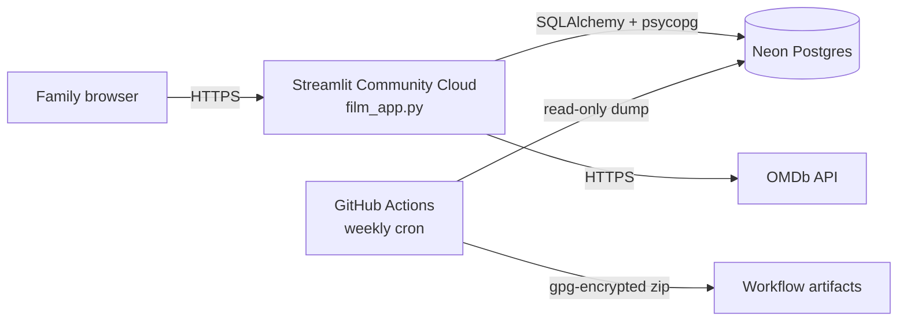

# Family Movie Ratings

[](https://github.com/josephperrin98/perrin-family-movies/actions/workflows/tests.yml)

A small web app my family uses to rate the films we watch together, keep a
watchlist, and settle arguments with a fair "family Top 100".

Built with Python and [Streamlit](https://streamlit.io), backed by Postgres,
with film data from the [OMDb API](https://www.omdbapi.com/).

## How we use it

1. Open the app and enter the shared family passphrase.
2. Pick who you are on the "Who's watching?" screen.
3. Search for a film you've watched, give it a score out of 10 and a comment,
   and flag whether it's suitable for the whole family.
4. Browse what everyone else has been watching, open any film to see all the
   family's ratings, and add films to your watchlist.
5. Check the **Top 100**, filterable by genre and country.

## Features

| Page | What it does |
|---|---|
| Browse | Search OMDb and see the family's latest ratings, filterable by person and genre |
| Top 100 | Family ranking using per-person normalised scores (see below) |
| Family | Everyone's profile and stats |
| Your Movies | Your ratings and watchlist, or anyone else's |
| Add Review | Find a film via OMDb (or enter it manually) and rate it |

### Fair rankings: per-person z-score normalisation

Some people rate everything 8+, others rarely go above 6. A plain average
rewards films watched by generous raters. The Top 100 instead converts each
score into a *z-score*: how far it sits from **that person's** average, in units
of **that person's** spread (standard deviation). Those are mapped back onto a
1–10 scale and averaged per film, so a 7 from a harsh critic can outrank a 9
from someone who loves everything. See `get_family_top100` in
[`database.py`](database.py).

## Architecture



- **Code** lives in this repo. Streamlit Community Cloud redeploys on every
  push to `main`.
- **Data** lives in [Neon](https://neon.tech), a serverless Postgres. Nothing
  personal is stored in git.
- **Secrets** (database URL, API key, passphrase) are stored in Streamlit's
  and GitHub's secret managers, never in the repo.

### Project layout

```
film_app.py            Entry point: page config, navigation, routing
identity.py            Family passphrase gate and "who's watching" picker
database.py            Schema and all SQL queries (SQLAlchemy Core)
omdb.py                OMDb API client
pages/                 One module per screen
components/            Reusable UI pieces (movie cards, search, filters)
scripts/
  import_csv.py        Bulk-import ratings from a spreadsheet export
  backup_database.py   Dump every table to a zip of CSVs
examples/              Demo CSV in the import format
tests/                 unittest suite (no network or database needed)
```

## Running it yourself

### 1. Get your keys

| Secret | Where to get it |
|---|---|
| `DATABASE_URL` | Create a free project on [Neon](https://neon.tech), then **Connect** → copy the *pooled* connection string. Any Postgres works. |
| `OMDB_API_KEY` | Request a free key at [omdbapi.com/apikey.aspx](https://www.omdbapi.com/apikey.aspx). It arrives by email and must be activated. |
| `family_pin` | Optional. Any passphrase. Prefer a few words over 4 digits: there is no lockout on wrong attempts. |

### 2. Run locally

Requires Python 3.11+.

```bash
python3.11 -m venv .venv
source .venv/bin/activate
pip install -r requirements.txt
cp .streamlit/secrets.toml.example .streamlit/secrets.toml   # then edit it
streamlit run film_app.py
```

Tables are created automatically on first launch. If there are no users yet,
the people listed under `family_members` in your secrets are created (or three
demo members if you leave it out).

### 3. Deploy

On [Streamlit Community Cloud](https://share.streamlit.io): **Create app** →
pick this repo, branch `main`, file `film_app.py` → paste the contents of your
`secrets.toml` into **Advanced settings → Secrets**.

### Importing ratings from a spreadsheet

The importer reads a CSV exported from our original family spreadsheet (French
column headers). See [`examples/demo_ratings.csv`](examples/demo_ratings.csv)
for the format. Users must already exist; contributors are matched by display
name.

```bash
DATABASE_URL=... OMDB_API_KEY=... python scripts/import_csv.py examples/demo_ratings.csv
```

## Backups

[`weekly-backup.yml`](.github/workflows/weekly-backup.yml) dumps every table
each Monday, encrypts the zip with `gpg` (AES-256), and keeps it as a workflow
artifact for 90 days. Artifacts on a public repo can be downloaded by anyone
signed in to GitHub, so the workflow refuses to upload unless the
`BACKUP_PASSPHRASE` repository secret is set.

To restore, download the artifact and decrypt it:

```bash
gpg --decrypt backup_YYYYMMDD_HHMMSS.zip.gpg > backup.zip
```

## Tests

```bash
python -m unittest -v
```

The suite needs no network or database. It runs on every push via
[`tests.yml`](.github/workflows/tests.yml).

## Design notes

- **Dependencies are pinned to exact versions.** In September 2026 the app went
  down without a single code change: `requirements.txt` allowed any SQLAlchemy
  `>=2.0`, and SQLAlchemy 2.1 switched its default Postgres driver from
  psycopg2 to psycopg 3. Pinning makes upgrades deliberate, and
  [`tests/test_dependencies.py`](tests/test_dependencies.py) catches a
  driver mismatch without touching a database.
- **One shared passphrase, not per-person accounts.** The realistic threat for a
  family app is a stranger finding the URL, not relatives impersonating each
  other. The passphrase is compared with `hmac.compare_digest` so response time
  doesn't reveal how much of a guess was right.
- **Standard library first.** Tests use `unittest`, backups use `zipfile` and
  `csv`. Every extra dependency is something that can break.

## Roadmap

Next up: AI agents on top of the ratings data, from a monthly viewing summary
to film recommendations to logging past viewings in plain language.

## License

[MIT](LICENSE)
